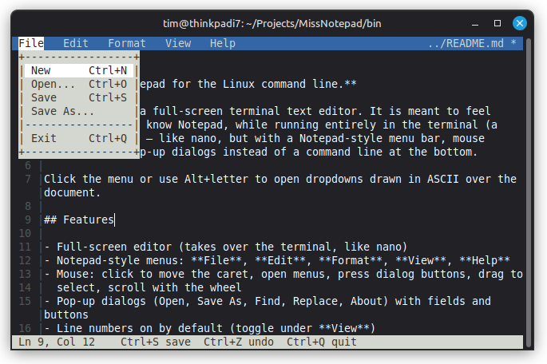

# MissNotepad

**Microsoft Notepad for the Linux command line.**

MissNotepad is a full-screen terminal text editor. It is meant to feel familiar if you
know Notepad, while running entirely in the terminal (a TUI, not a GUI) — like
nano, but with a Notepad-style menu bar, mouse support, and pop-up dialogs
instead of a command line at the bottom.

The menuing style is inspired by [Links](http://links.twibright.com/), the
text-mode web browser: click or use Alt+letter to open dropdowns drawn in
ASCII over the document.



## Features

- Full-screen editor (takes over the terminal, like nano)
- Notepad-style menus: **File**, **Edit**, **Format**, **View**, **Help**
- Mouse: click to move the caret, open menus, press dialog buttons, drag to
  select, scroll with the wheel
- Pop-up dialogs (Open, Save As, Find, Replace, About) with fields and buttons
- Line numbers on by default (toggle under **View**)
- Word wrap (**Format → Word Wrap**)
- Cut, copy, paste, select all, undo/redo
- Search and replace
- Key-binding themes: **Notepad** (default), **nano**, **vi**, **Emacs**
- Settings saved to `~/.config/missnotepad/config`

## Quick install

One command installs the latest static binary — no compiler, no root, no
distro-specific steps (works on glibc and musl systems, x86_64 and aarch64):

```sh
curl -fsSL https://raw.githubusercontent.com/tkoop/miss-notepad/master/scripts/install.sh | sh
```

The script downloads a static binary from
[Releases](https://github.com/tkoop/miss-notepad/releases), verifies its
SHA-256 checksum, and installs to `~/.local/bin` (override the destination
with `MISS_INSTALL_DIR=/some/path sh install.sh`, or pass a version like
`install.sh 1.2.0`).

Prefer a native package? The release page also carries a `.deb`
(Debian/Ubuntu/Mint) and an `.rpm` (Fedora/openSUSE); Arch users can use
`packaging/PKGBUILD` from this repo (AUR submission pending).

## Build / compile

You need a C11 compiler (`gcc` or `clang`), `make`, and a POSIX system. For
desktop clipboard support, install `wl-clipboard` on Wayland or `xclip`/`xsel`
on X11. MissNotepad talks to the terminal with termios and ANSI escapes.

```sh
make
```

The executable is written to `bin/miss`.

Debug build:

```sh
make CFLAGS="-std=c11 -Wall -Wextra -Werror -pedantic -g -O0"
```

Clean:

```sh
make clean
```

Fully static build (runs on any Linux, glibc or musl — this is what the
release binaries use):

```sh
make static
```

Install to `/usr/local/bin` (override with `PREFIX=...`, or stage a
package with `DESTDIR=...`):

```sh
sudo make install
```

## Install (from source)

MissNotepad has no hard dependencies beyond a C11 compiler, `make`, and a
POSIX system. Pick your distro below to install the build tools — plus the
optional clipboard helpers for desktop copy/paste — then build.

### Debian / Ubuntu / Mint / Pop!_OS

```sh
sudo apt update
sudo apt install build-essential git wl-clipboard xclip
```

### Fedora

```sh
sudo dnf install gcc make git wl-clipboard xclip
```

### Arch Linux / Manjaro / EndeavourOS

```sh
sudo pacman -S --needed base-devel git wl-clipboard xclip
```

### openSUSE

```sh
sudo zypper install gcc make git wl-clipboard xclip
```

### Alpine Linux

```sh
sudo apk add build-base git wl-clipboard xclip
```

(`build-base` and `wl-clipboard` live in the `community` repository, which is
enabled by default on recent releases.)

### Void Linux

```sh
sudo xbps-install -S base-devel git wl-clipboard xclip
```

### NixOS

```sh
nix-shell -p gcc make git wl-clipboard xclip
```

(`base-devel` on Arch/Void and `build-essential`/`build-base` on Debian/Alpine
each include the compiler and `make`. `clang` works in place of `gcc` on any
distro.)

### Build and install (all distros)

```sh
git clone https://github.com/tkoop/miss-notepad.git
cd miss-notepad
make
sudo cp bin/miss /usr/local/bin/miss
```

Or keep it local and run `bin/miss`. See **Build / compile** above for debug
builds and `make clean`.

### Clipboard support (optional)

MissNotepad only needs a helper binary for desktop clipboard integration; the
commands above install both flavors, but you can trim to what you use:

- **Wayland:** `wl-clipboard` (provides `wl-copy` / `wl-paste`)
- **X11:** `xclip` (or `xsel`)

Without a helper, everything else still works — text selection still goes
through the terminal.

## Run

```sh
miss
miss notes.txt
miss --help
miss --version
```

MissNotepad needs a real terminal (not a pipe). It uses the alternate screen buffer
and restores your shell when you quit.

## How to use

### Mouse

Click the menu names on the top row. Click inside a dropdown to choose an
item. Click in the text to move the caret. Drag to select. Use the scroll
wheel to move. Dialogs have **[ OK ]** and **[ Cancel ]** buttons you can
click.

### Menus (Notepad-style)

| Menu   | Items |
|--------|--------|
| File   | New, Open…, Save, Save As…, Exit |
| Edit   | Undo, Redo, Cut, Copy, Paste, Delete, Select All, Find…, Find Next, Replace… |
| Format | Word Wrap |
| View   | Line Numbers; Notepad / nano / vi / Emacs keys |
| Help   | Keyboard shortcuts, About MissNotepad |

Open a menu with **F10**, **Alt+F / E / O / V / H**, or the mouse. Move with
the arrows, activate with Enter, leave with Esc.

### Notepad keys (default)

| Key | Action |
|-----|--------|
| Ctrl+N | New |
| Ctrl+O | Open |
| Ctrl+S | Save |
| Ctrl+Q | Exit |
| Ctrl+Z / Y | Undo / Redo |
| Ctrl+X / C / V | Cut / Copy / Paste |
| Ctrl+A | Select All |
| Ctrl+F | Find |
| F3 | Find Next |
| Ctrl+H | Replace |
| Shift+arrows | Select |
| Arrows, Home, End, Page Up/Down | Move |

### nano keys

| Key | Action |
|-----|--------|
| Ctrl+O | Save |
| Ctrl+X | Exit |
| Ctrl+W | Find |
| Ctrl+\ | Replace |
| Ctrl+K | Cut to end of line |
| Ctrl+U | Paste |
| Ctrl+G | Help |

### vi keys

MissNotepad starts vi theme in **normal** mode (`-- NORMAL --` on the status line).

| Key | Action |
|-----|--------|
| i | Insert mode |
| Esc | Normal mode |
| h j k l | Move |
| x | Delete character |
| p | Paste |
| u | Undo |
| / | Find |
| n | Find next |
| :w :q :wq :q! | Save / quit (pop-up, not a bottom command line) |

### Emacs keys

| Key | Action |
|-----|--------|
| C-x C-s | Save |
| C-x C-c | Quit |
| C-x C-f | Open |
| C-x C-w | Save As |
| C-s | Find |
| C-y | Paste |
| C-w | Cut |
| C-k | Kill to end of line |
| C-a / C-e | Beginning / end of line |
| C-f / C-b / C-n / C-p | Move |

### Settings

MissNotepad reads and writes `~/.config/missnotepad/config`:

```
show_linenum=1
word_wrap=1
tabstop=4
key_theme=notepad
```

`key_theme` may be `notepad`, `nano`, `vi`, or `emacs`.

## Tests

```sh
make test
```

This builds the editor, runs the unit-test suite (buffer, UTF-8, keys, screen,
editor, menus, dialogs, search, wrap, key bindings, files), and a few CLI
checks. All tests must pass.

## Project layout

```
include/missnotepad/   Public headers
src/            Implementation
tests/          Unit tests and runner
bin/miss               Built executable
Makefile
CHANGELOG.md
```

## Version

MissNotepad **1.2.0** — the Notepad-for-the-terminal
vision.
